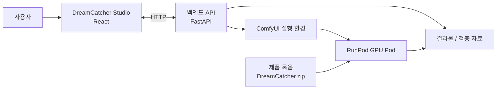

# DreamCatcher

DreamCatcher는 개인용 프로 사진 편집 스튜디오입니다. 사용자가 ComfyUI를 직접 다루는 대신, RAW 준비, 병합/디노이즈, 배경 제거/생성, 오브젝트 편집, 품질 검수, 납품 패키징을 하나의 제품 흐름 안에서 처리하도록 설계했습니다.

이 저장소는 공개 가능한 소스와 제품 문서를 담은 공개 저장소입니다. 실제 개발 이력, 운영용 비밀값, 실험 산출물, 모델 접근 토큰, 배포 환경 정보는 `DreamCatcher-private`에서 관리합니다.

## 커리어 근거로 읽는 법

| 항목 | 내용 |
| --- | --- |
| 프로젝트 유형 | 개인 제품형 프로젝트 |
| 내 역할 | 풀스택 개발, AI 작업 흐름 설계, RunPod 실행 기준, 배포 묶음/검증 기준 정리 |
| 주력 기술 | Python 3.12, FastAPI, React 19, TypeScript, Vite, React Query, Zustand, ComfyUI, RunPod |
| 보여주고 싶은 역량 | 모델 호출을 제품 흐름, 실행 환경 계약, 품질 검수, 배포 산출물로 연결하는 역량 |
| 대표 근거 | `PROJECT_FOUNDATION/README.md`, `RUNPOD_VALIDATION_CHECKLIST.md`, `Product/BUILD_MANUAL.md`, 백엔드 테스트와 배포 사전 검증 |

제가 이 프로젝트에서 강조하고 싶은 부분은 이미지 생성 모델 자체가 아니라, **AI 편집 기능을 반복 실행 가능한 제품/운영 흐름으로 묶는 일**입니다. RunPod pod는 일회성 실행 환경으로 보고, 모델 준비 상태, 임시 작업 흐름, 저장소 계약, 결과물/검증 자료 회수까지 배포 검증 기준으로 다루는 방향을 잡았습니다.

## 프로젝트 목표

사진 편집 AI 작업 흐름은 강력하지만, 실제 사용 단계에서는 모델 가중치, 사용자 정의 노드, seed 작업 흐름, GPU 환경, 결과물 회수, 품질 검수, 납품 패키징이 모두 분리되어 있어 반복 사용이 어렵습니다. DreamCatcher는 이 과정을 "스튜디오에서 요청하고, 백엔드가 ComfyUI와 RunPod를 조율하며, 검수 자료를 남기고, 납품 가능한 결과물로 묶는" 제품 경험으로 정리합니다.

핵심 판단은 다음과 같습니다.

- 사용자는 ComfyUI 그래프가 아니라 스튜디오 작업면을 본다.
- RunPod GPU pod는 장기 저장소가 아니라 세션 실행 환경으로 본다.
- 결과물과 검증 자료는 pod 종료 전에 회수하고, pod는 정지/종료한다.
- 임시 작업 흐름이나 모의 성공 응답은 배포 묶음에 들어가지 않는다.
- 모델 준비 상태, 저장소 계약, 사용자 정의 노드 계약은 자동 검증으로 확인한다.

## 핵심 사용자 흐름

1. 원본 사진 또는 RAW 입력을 Studio에 추가한다.
2. 입력 상태를 분석하고, 필요한 보정/복원 목표를 선택한다.
3. cutout, background, fill/outpaint, relight, retouch, enhance 작업을 요청한다.
4. 백엔드가 ComfyUI 작업 흐름과 모델 준비 상태를 확인하고 작업을 실행한다.
5. Qwen 판정 모델과 지표/검사기 검증 자료를 통해 결과물을 검수한다.
6. 사용자가 승인한 결과를 최종 preset, proofing sheet, 납품 패키지로 묶는다.
7. RunPod 결과물과 검증 자료를 회수한 뒤 pod를 종료한다.

## 주요 기능

| 영역 | 내용 |
| --- | --- |
| 스튜디오 화면 | 원본, RAW, 편집, 검수, 납품, 운영 탭을 가진 React 기반 작업면 |
| 백엔드 조율 | FastAPI가 스튜디오 요청을 받아 ComfyUI, 저장소, 배포 검증 기준을 조율 |
| ComfyUI 작업 흐름 | 공개 가능한 seed 묶음과 작업 흐름 계약을 기준으로 이미지 편집 흐름 구성 |
| RAW 준비 | 병합, 디노이즈, 정렬, 신뢰도 검증 자료 기반 RAW 전처리 방향 |
| 품질 검수 | 판정 검증 자료 묶음, 기준 보정, 사람 승인 흐름 |
| RunPod 패키징 | `Product/DreamCatcher.zip` 생성, 업로드, 초기화, 사전 검증 |
| 운영 문서 | 새 복제본 인수인계, RunPod 검증 체크리스트, 빌드/사용자 매뉴얼 |

## 기술 스택

| 영역 | 기술 |
| --- | --- |
| 프론트엔드 | React, Vite, TypeScript, Zustand, React Query, react-konva, lucide-react |
| 백엔드 | Python 3.12, FastAPI, Pydantic, uv, pytest |
| AI 실행 환경 | ComfyUI, RunPod GPU Pod, CUDA 기반 ComfyUI image |
| 품질 검증 | pytest, typecheck, seed 묶음 검증, 배포 사전 검증 |
| 패키징 | PowerShell/Python 배포 도구, zip 기반 일회성 배포 |

## 아키텍처 개요



## 저장소 구조

```text
DreamCatcher
+-- app/backend             # FastAPI 조율, 실행 환경 계약, 테스트
+-- app/frontend            # React 스튜디오 화면
+-- Product                 # 사용자 매뉴얼, 빌드 매뉴얼, 배포 묶음 기준 문서
+-- PROJECT_FOUNDATION      # 제품 기준, 운영 원칙, RunPod 검증 체크리스트
+-- runpod                  # RunPod 초기화, 사전 검증, 패키징 도구
+-- seed_bundle             # 공개 가능한 seed 작업 흐름 기준 자료
+-- benchmark               # 품질/성능 확인용 공개 벤치마크 도구
\-- local_data_lab          # 공개 가능한 로컬 실험 골격
```

## 로컬 실행

```powershell
uv sync --project app\backend
npm ci --prefix app\frontend
uv run --project app\backend python -m pytest
npm run typecheck --prefix app\frontend
npm run build --prefix app\frontend
```

개발 판단과 인수인계 기준은 `PROJECT_FOUNDATION/README.md`를 확인합니다. 실제 사용자 실행과 RunPod 업로드 절차는 `Product/USER_MANUAL.md`, `Product/BUILD_MANUAL.md`, `PROJECT_FOUNDATION/RUNPOD_VALIDATION_CHECKLIST.md`를 기준으로 합니다.

## 검증 명령

```powershell
uv run --project app\backend python -m pytest
npm run typecheck --prefix app\frontend
npm run build --prefix app\frontend
python app\scripts\verify_seed_bundle.py --seed-root seed_bundle
uv run --project app\backend python runpod\preflight_release_bundle.py
```

## 공개 범위

공개 저장소에는 공개 가능한 애플리케이션 소스, 제품 문서, seed 작업 흐름 계약, 로컬 검증 골격만 둡니다. 다음 항목은 포함하지 않습니다.

- Hugging Face 토큰, RunPod 키, 공급자 인증 정보
- gated 모델 가중치, 다운로드된 모델 캐시, 생성 결과물
- 비공개 배포 노트, 운영 실험 로그, 실제 사용자 데이터
- local `.env`, 비밀값 관리자 내보내기 파일, 비공개 백업 압축 파일

운영 비밀값과 전체 개발 이력은 비공개 저장소와 별도 백업에서 관리합니다.
