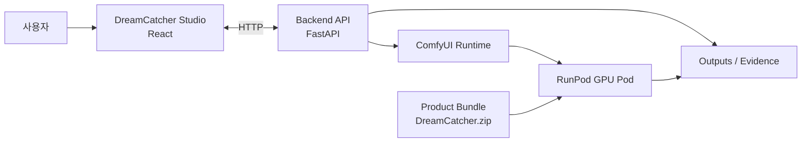

# DreamCatcher

DreamCatcher는 개인용 프로 사진 편집 Studio입니다. 사용자가 ComfyUI를 직접 다루는 대신, RAW 준비, 병합/디노이즈, 배경 제거/생성, 오브젝트 편집, 품질 검수, 납품 패키징을 하나의 제품 흐름 안에서 처리하도록 설계했습니다.

이 저장소는 공개 가능한 소스와 제품 문서를 담은 public repo입니다. 실제 개발 history, 운영용 secret, 실험 산출물, 모델 접근 토큰, 배포 환경 정보는 `DreamCatcher-private`에서 관리합니다.

## 커리어 근거로 읽는 법

| 항목 | 내용 |
| --- | --- |
| 프로젝트 유형 | 개인 제품형 프로젝트 |
| 내 역할 | 풀스택 개발, AI workflow 설계, RunPod 실행 기준, release bundle/검증 기준 정리 |
| 주력 기술 | Python 3.12, FastAPI, React 19, TypeScript, Vite, React Query, Zustand, ComfyUI, RunPod |
| 보여주고 싶은 역량 | 모델 호출을 제품 흐름, runtime contract, 품질 검수, 배포 산출물로 연결하는 역량 |
| 대표 근거 | `PROJECT_FOUNDATION/README.md`, `RUNPOD_VALIDATION_CHECKLIST.md`, `Product/BUILD_MANUAL.md`, backend test와 release preflight |

제가 이 프로젝트에서 강조하고 싶은 부분은 이미지 생성 모델 자체가 아니라, **AI 편집 기능을 반복 실행 가능한 제품/운영 흐름으로 묶는 일**입니다. RunPod pod는 일회성 실행 환경으로 보고, 모델 준비 상태, workflow placeholder, storage contract, output/evidence 회수까지 release gate로 다루는 방향을 잡았습니다.

## 프로젝트 목표

사진 편집 AI 워크플로는 강력하지만, 실제 사용 단계에서는 모델 weight, custom node, seed workflow, GPU 환경, 결과물 회수, 품질 검수, 납품 패키징이 모두 분리되어 있어 반복 사용이 어렵습니다. DreamCatcher는 이 과정을 "Studio에서 요청하고, backend가 ComfyUI와 RunPod를 조율하며, 검수 evidence를 남기고, 납품 가능한 결과물로 묶는" 제품 경험으로 정리합니다.

핵심 판단은 다음과 같습니다.

- 사용자는 ComfyUI graph가 아니라 Studio 작업면을 본다.
- RunPod GPU pod는 장기 저장소가 아니라 세션 실행 환경으로 본다.
- 결과물과 evidence는 pod 종료 전에 회수하고, pod는 stop/terminate한다.
- placeholder workflow나 mock 성공 응답은 release bundle에 들어가지 않는다.
- 모델 준비 상태, storage contract, custom node contract는 자동 검증으로 확인한다.

## 핵심 사용자 흐름

1. 원본 사진 또는 RAW 입력을 Studio에 추가한다.
2. 입력 상태를 분석하고, 필요한 보정/복원 목표를 선택한다.
3. cutout, background, fill/outpaint, relight, retouch, enhance 작업을 요청한다.
4. backend가 ComfyUI workflow와 모델 준비 상태를 확인하고 작업을 실행한다.
5. Qwen judge와 metric/checker evidence를 통해 결과물을 검수한다.
6. 사용자가 승인한 결과를 final preset, proofing sheet, delivery package로 묶는다.
7. RunPod output과 evidence를 회수한 뒤 pod를 종료한다.

## 주요 기능

| 영역 | 내용 |
| --- | --- |
| Studio UI | 원본, RAW, 편집, 검수, 납품, 운영 탭을 가진 React 기반 작업면 |
| Backend orchestration | FastAPI가 Studio 요청을 받아 ComfyUI, storage, release gate를 조율 |
| ComfyUI workflow | 공개 가능한 seed bundle과 workflow contract를 기준으로 이미지 편집 흐름 구성 |
| RAW 준비 | merge, denoise, alignment, confidence evidence 기반 RAW 전처리 방향 |
| 품질 검수 | judge evidence packet, golden calibration, human approval 흐름 |
| RunPod packaging | `Product/DreamCatcher.zip` 생성, 업로드, bootstrap, preflight 검증 |
| 운영 문서 | fresh clone handoff, RunPod validation checklist, build/user manual |

## 기술 스택

| 영역 | 기술 |
| --- | --- |
| Frontend | React, Vite, TypeScript, Zustand, React Query, react-konva, lucide-react |
| Backend | Python 3.12, FastAPI, Pydantic, uv, pytest |
| AI runtime | ComfyUI, RunPod GPU Pod, CUDA 기반 ComfyUI image |
| Quality gate | pytest, typecheck, seed bundle verification, release preflight |
| Packaging | PowerShell/Python release tooling, zip-based ephemeral deployment |

## 아키텍처 개요



## 저장소 구조

```text
DreamCatcher
+-- app/backend             # FastAPI orchestration, runtime contracts, tests
+-- app/frontend            # React Studio UI
+-- Product                 # 사용자 매뉴얼, 빌드 매뉴얼, release bundle 기준 문서
+-- PROJECT_FOUNDATION      # 제품 기준, 운영 원칙, RunPod validation checklist
+-- runpod                  # RunPod bootstrap, preflight, packaging tooling
+-- seed_bundle             # 공개 가능한 seed workflow 기준 자료
+-- benchmark               # 품질/성능 확인용 공개 benchmark harness
\-- local_data_lab          # 공개 가능한 local experiment scaffold
```

## 로컬 실행

```powershell
uv sync --project app\backend
npm ci --prefix app\frontend
uv run --project app\backend python -m pytest
npm run typecheck --prefix app\frontend
npm run build --prefix app\frontend
```

개발 판단과 handoff 기준은 `PROJECT_FOUNDATION/README.md`를 확인합니다. 실제 사용자 실행과 RunPod 업로드 절차는 `Product/USER_MANUAL.md`, `Product/BUILD_MANUAL.md`, `PROJECT_FOUNDATION/RUNPOD_VALIDATION_CHECKLIST.md`를 기준으로 합니다.

## 검증 명령

```powershell
uv run --project app\backend python -m pytest
npm run typecheck --prefix app\frontend
npm run build --prefix app\frontend
python app\scripts\verify_seed_bundle.py --seed-root seed_bundle
uv run --project app\backend python runpod\preflight_release_bundle.py
```

## 공개 범위

public repo에는 공개 가능한 application source, product documentation, seed/workflow contract, local validation scaffold만 둡니다. 다음 항목은 포함하지 않습니다.

- Hugging Face token, RunPod key, provider credential
- gated model weight, 다운로드된 모델 cache, 생성 output
- private deployment note, 운영 실험 log, 실제 사용자 데이터
- local `.env`, secret manager export, private backup archive

운영 secret과 전체 개발 history는 private repo와 별도 백업에서 관리합니다.
